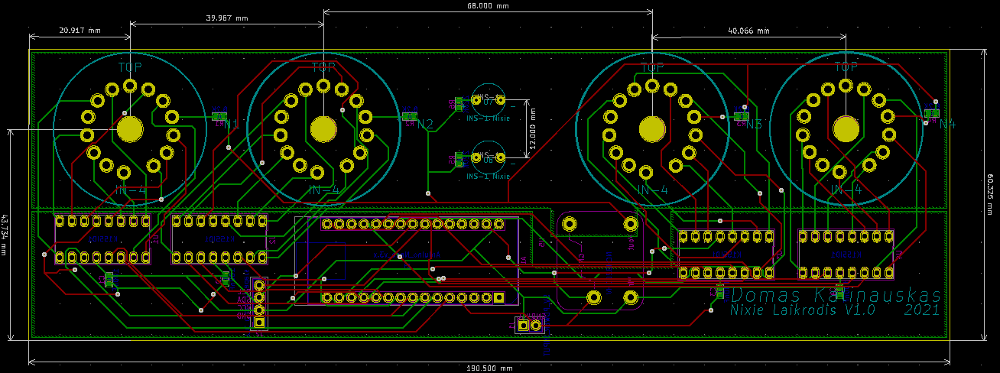
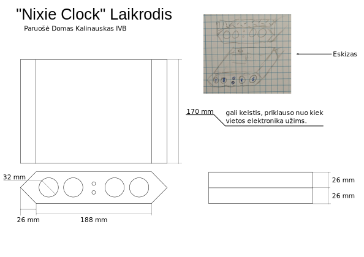
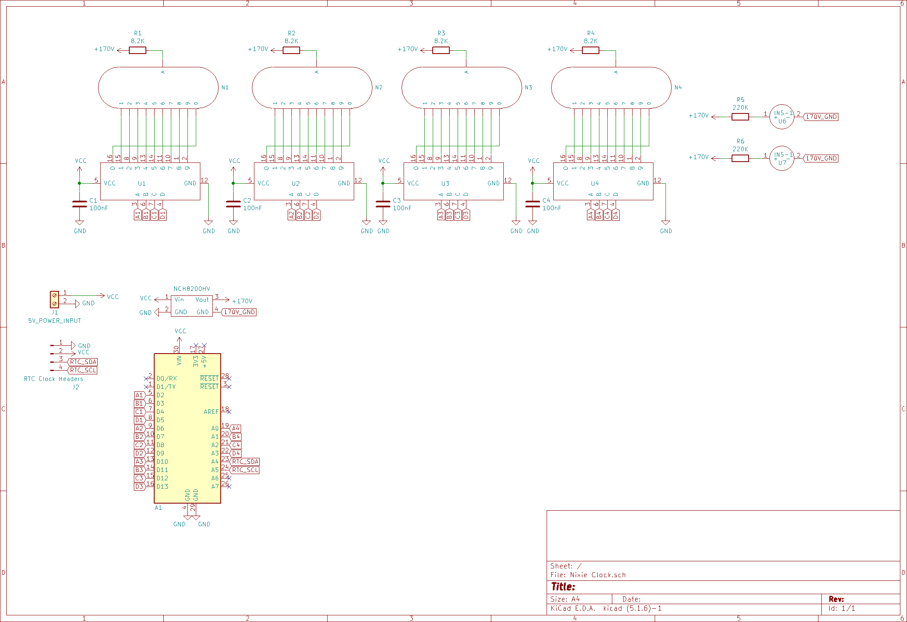
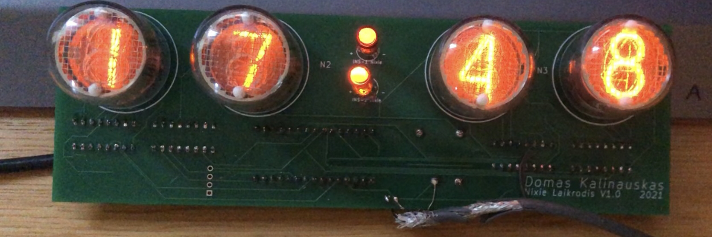

  <h1 align="center"><b>Nixie Clock</b></h1>

  

    Nixie clock for my design class, including the 3D renders, PCB design and photos of the finished pcb. The case is still W.I.P
  

  
  

<!-- ABOUT THE PROJECT -->
# About The Project
<a href="https://github.com/lynxcs/aprasymas.pdf">Details in lithuanian here</a>

## Tools used

    The nixie clock was made using Blender, inkscape and kicad.

## 3D Model

First the 3D render was created as a rough idea about how I wanted the clock to look

  

## Case design

 Afterward I designed a blueprint with the dimensions for the case design 

  

## Schematic

 Upon completion of the case design, I started to work on the schematic 

  

## Components

    The PCB makes use of several components. The key components have been listed below
    <ul>
    <li>Arduino Pro Mini</li>
    <li>IN-4 Nixie Digits</li>
    <li>INS-1 Nixie Indicators</li>
    <li>K155ID1 high voltage drivers</li>
    <li>NCH8200HV high voltage boost converter (5v to 170v)</li>
    </ul>

## PCB Layout

 Then I made the PCB layout, trying my best to make it as small as possible, though sadly it wouldn't fit in the original case design dimensions

  

## Assembly

 Lastly I ordered the PCB's and got to soldering and programming

  

## Case mounting

<i>This part is still W.I.P</i>
